# Church Voice — Scripture Recording Platform

A platform for recording, managing, and listening to scripture audio narration — upload a manuscript, record verse-by-verse in a dedicated studio, and publish a Spotify-style listening experience with active-verse highlighting and auto-advance.

## Screenshots

**Public site**

| Home | Library | Book detail |
|---|---|---|
| 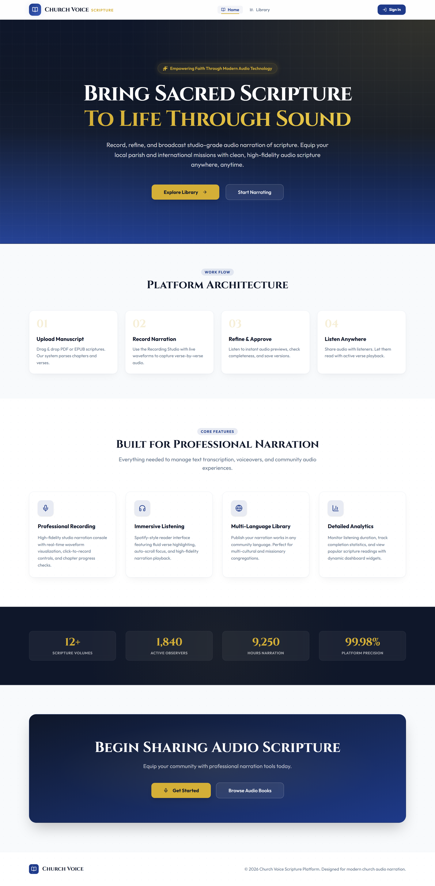 | 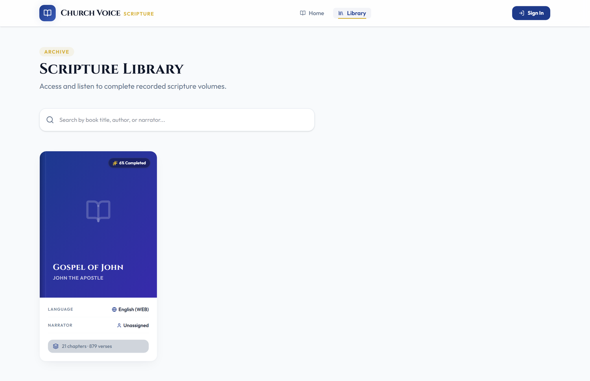 | 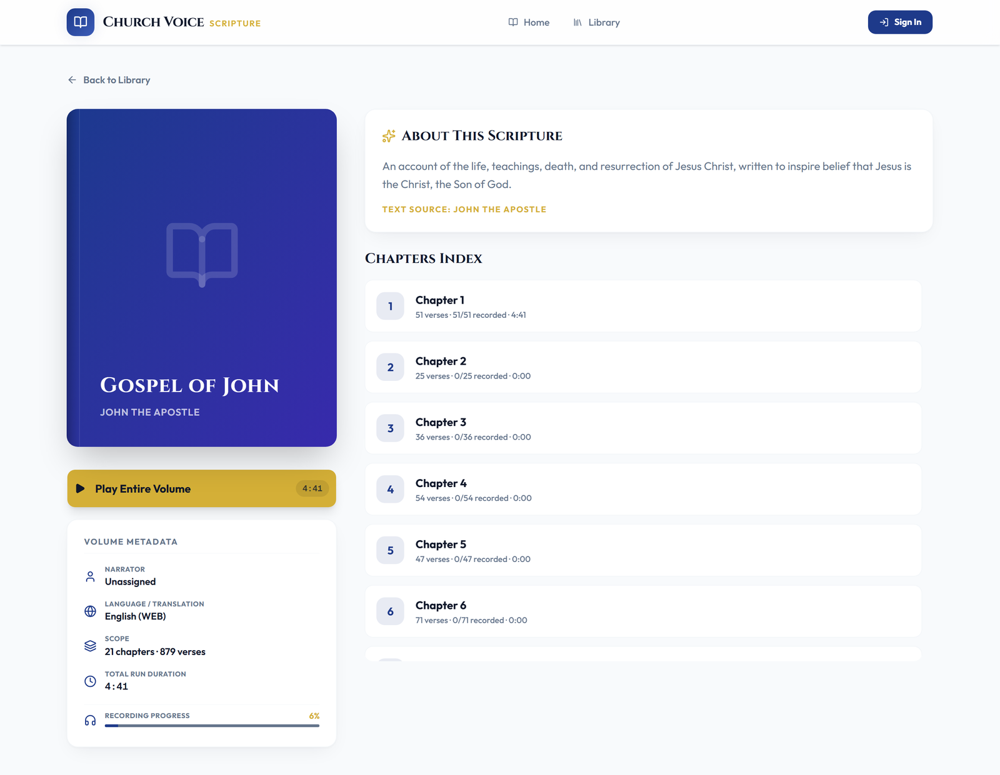 |

**Reader**

| Light | Playing | Dark |
|---|---|---|
| 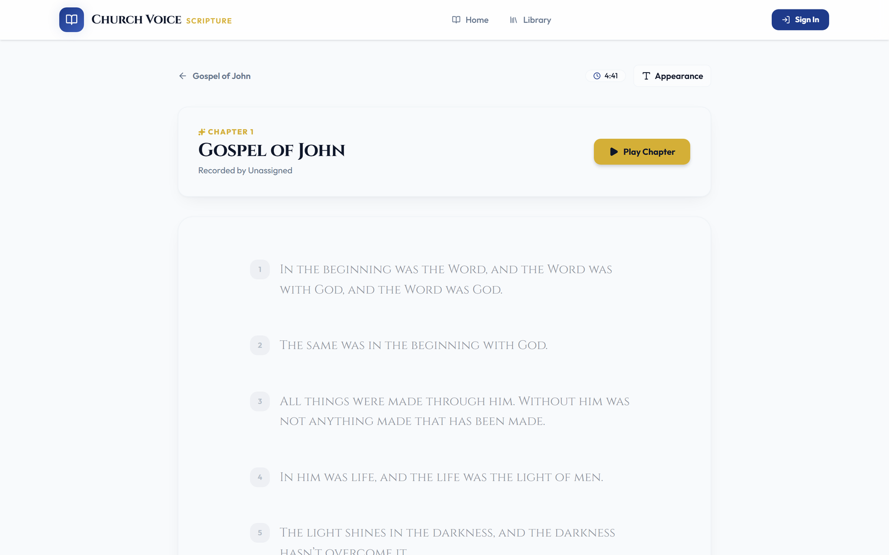 | 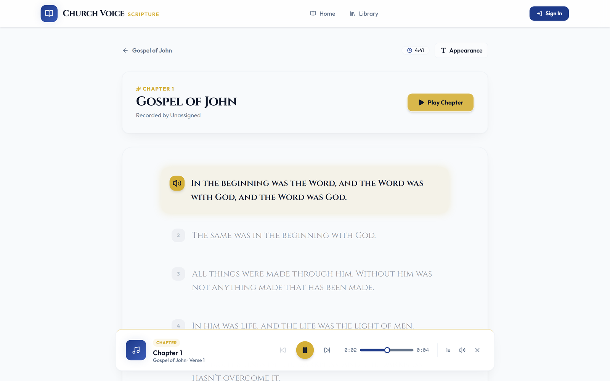 | 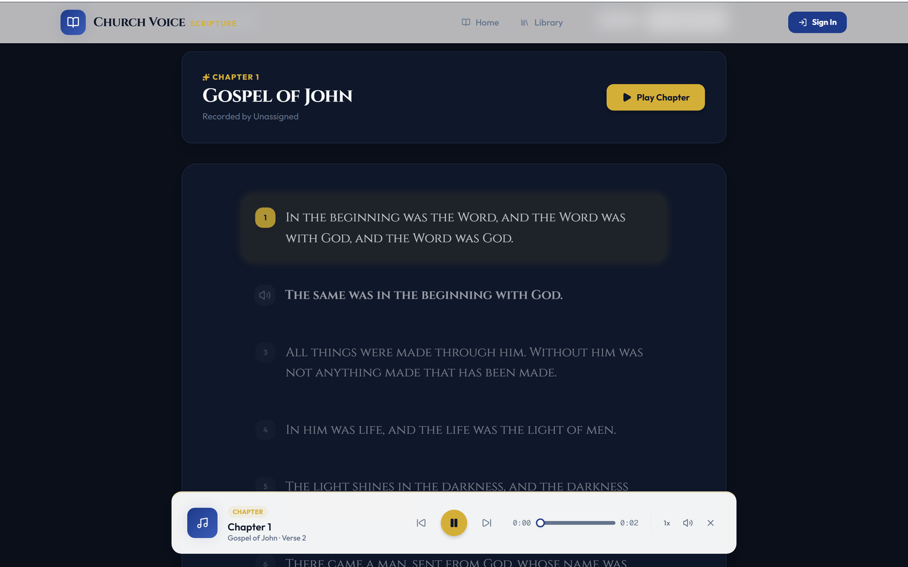 |

**Admin**

| Login | Dashboard | Management |
|---|---|---|
| 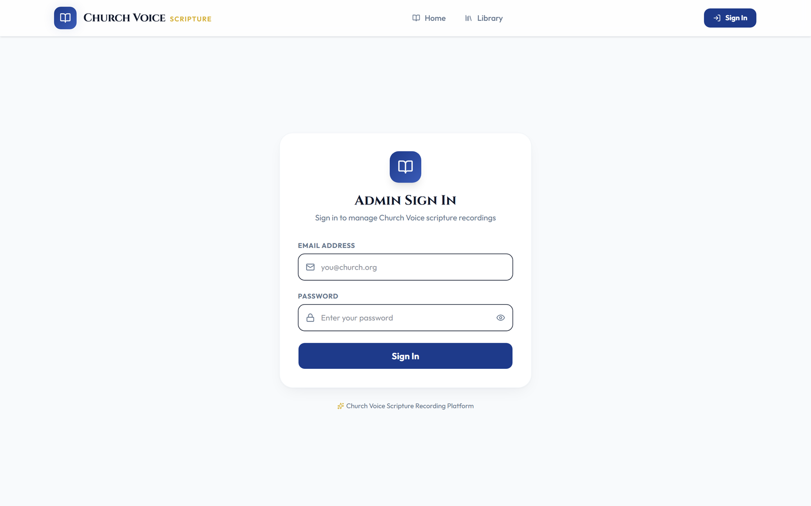 | 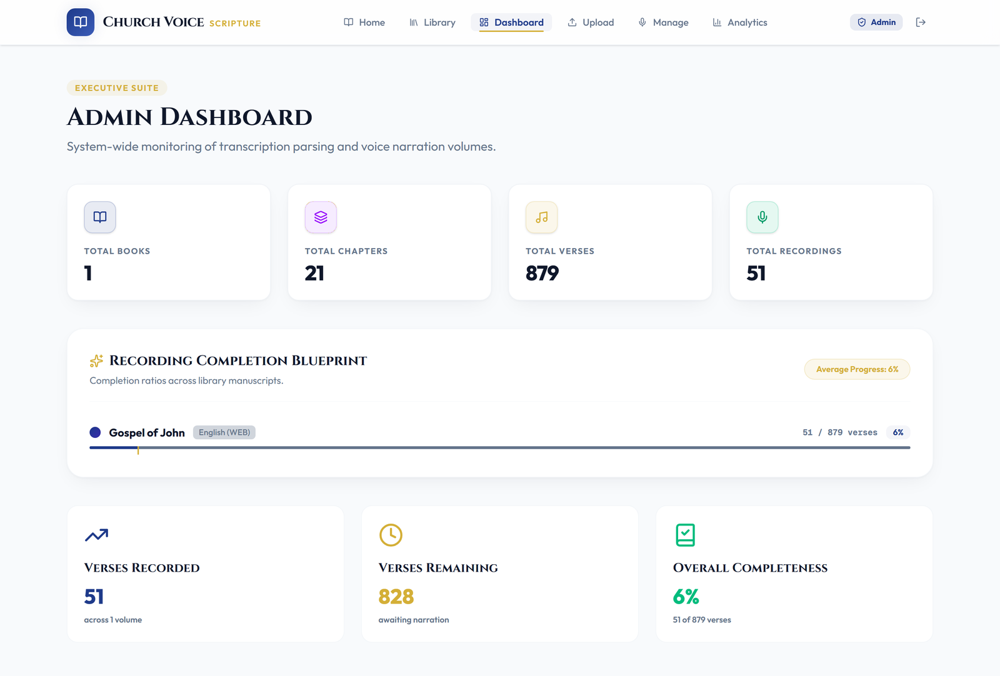 | 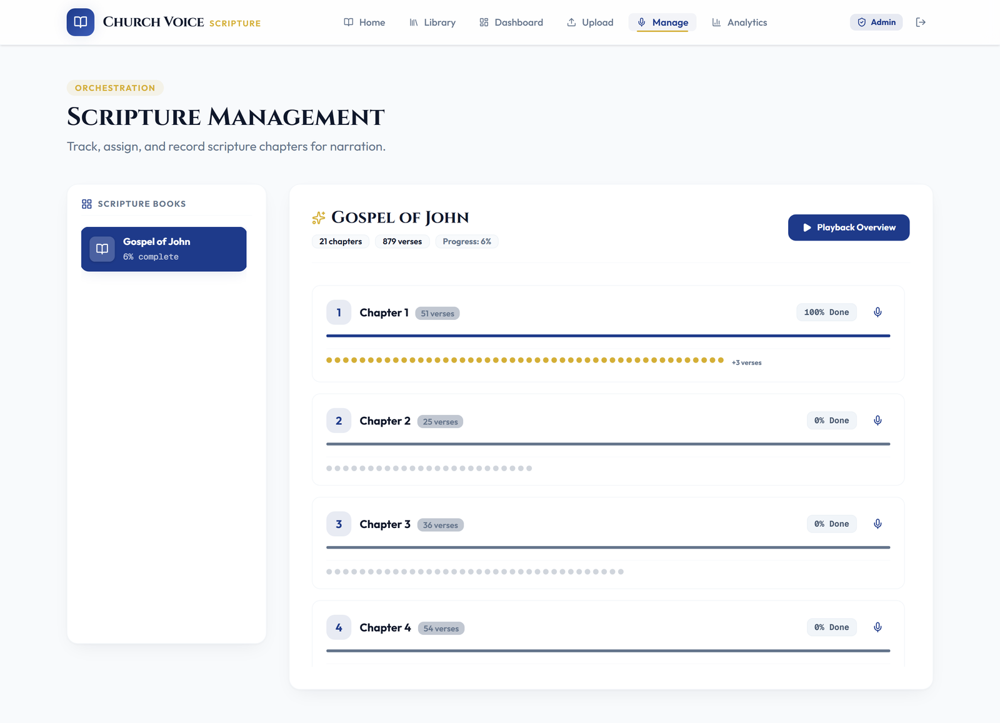 |

| Analytics | Upload | Recording Studio |
|---|---|---|
| 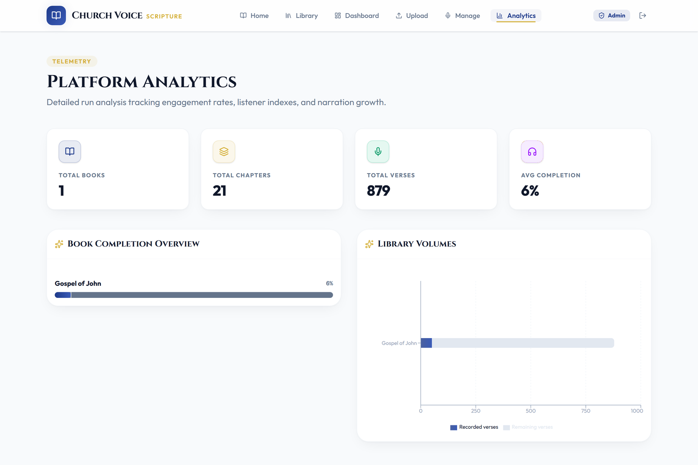 | 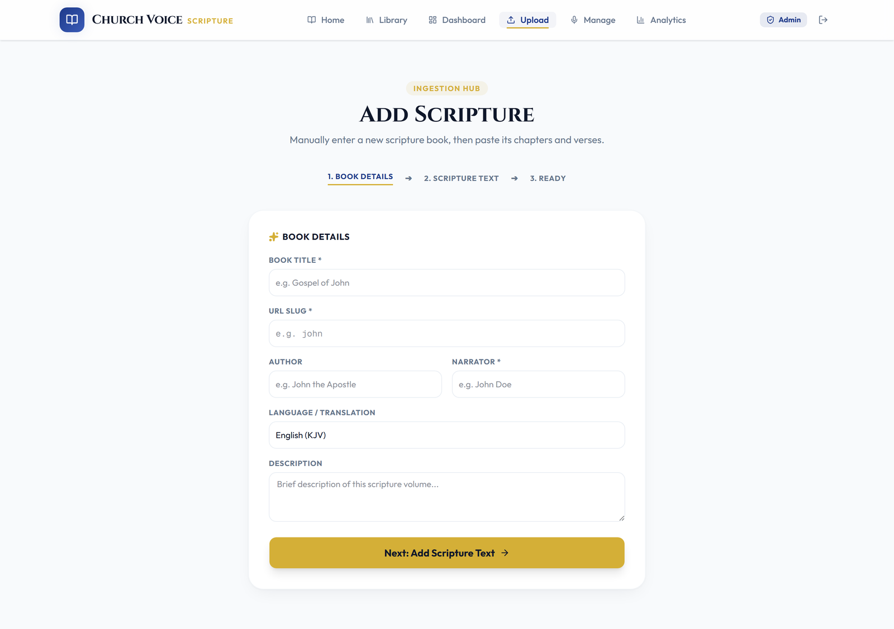 | 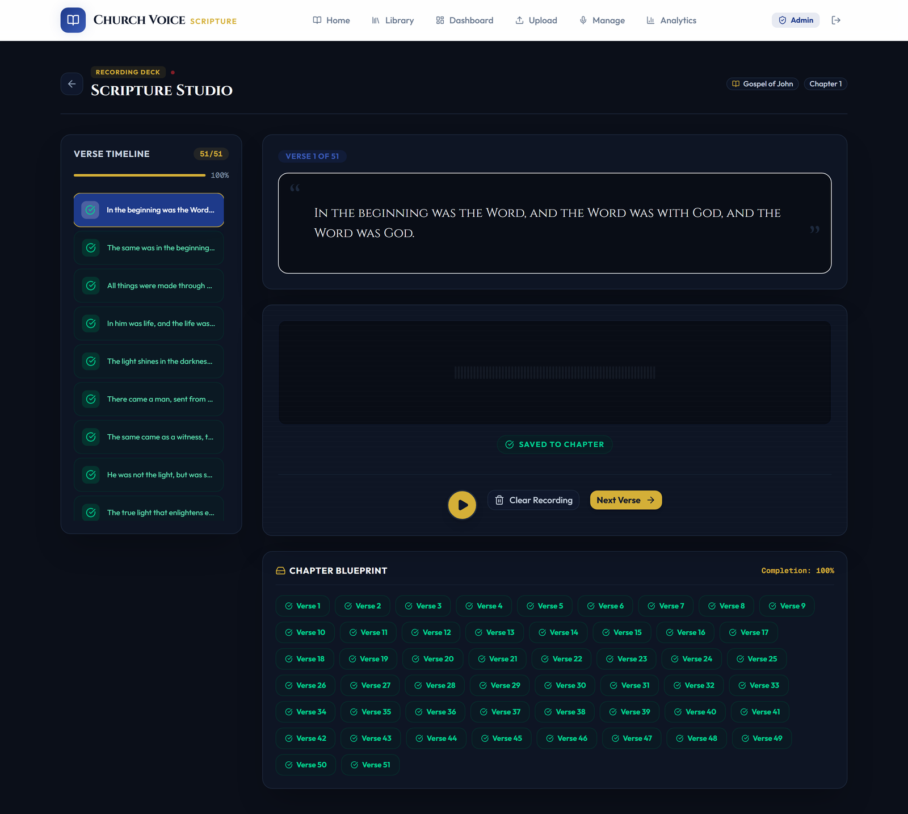 |

**Mobile**

| Home | Library | Reader |
|---|---|---|
| 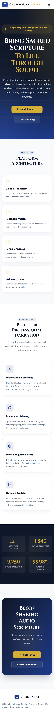 | 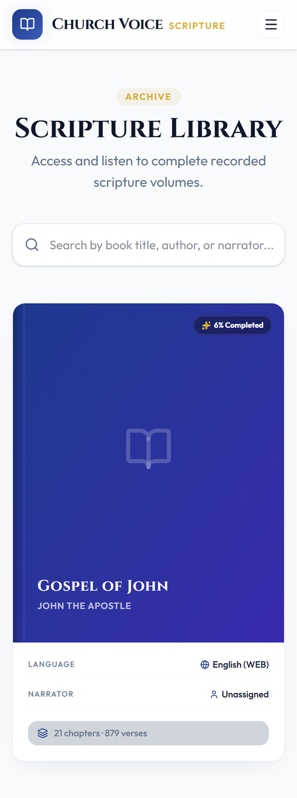 | 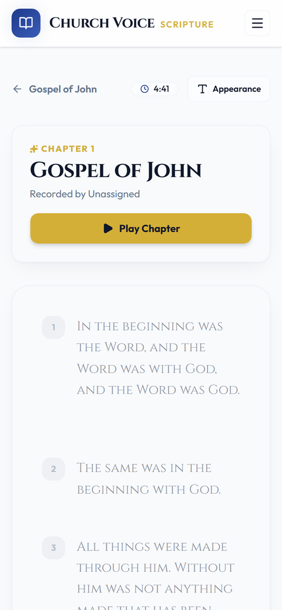 |

## How it works

- **Upload** — drag & drop a PDF or EPUB manuscript; the app parses it into books, chapters, and verses
- **Record** — the Scripture Studio steps through a chapter verse by verse, with a live waveform, a verse timeline, and a per-chapter completion blueprint
- **Publish** — the Reader shows recorded verses as playable with active-verse highlighting and auto-advance to the next recorded verse
- **Listen** — a persistent bottom player (play/pause, seek, skip, speed control) follows across pages
- **Admin** — a single-admin dashboard tracks books/chapters/verses/recordings totals, per-book completion, and listening analytics

## Tech Stack

- **Frontend:** Next.js 16 (App Router), React 19, Tailwind CSS 4, Framer Motion, Recharts, epub.js / pdf.js for manuscript parsing
- **Backend:** Supabase (Postgres, Auth) — no separate API server
- **Auth:** Single-admin login (env-configured credentials, session cookie)
- **Storage:** Audio recordings in Supabase; see `frontend/scripts/schema.sql` for the schema

## Quick Start (Development)

### Prerequisites

- Node.js 20+
- A Supabase project (Postgres + connection string)

### Setup

```bash
cd frontend
cp .env.example .env.local   # fill in Supabase URL/keys, admin email+password, session secret
npm install
npm run dev                  # starts on port 3000
```

Open [http://localhost:3000](http://localhost:3000).

## Project Structure

```
frontend/
  src/app/            Pages: home, library, book/[id], reader/[bookId]/[chapterId],
                       login, admin, management, analytics, upload, recording
  src/components/      UI and shared components
  src/lib/supabase/    Supabase client
  src/lib/auth/        Single-admin session auth
  scripts/             DB migration + schema
screenshots/           README screenshots
```

## License

Fork of [SudipThandar/Church-Voice-app](https://github.com/SudipThandar/Church-Voice-app).
